# Custom Modifications

This document details the custom modifications made to the original [notebooklm-mcp](https://github.com/PleasePrompto/notebooklm-mcp) project.

## Overview

**notebooklm-mcp-structured** is a fork that adds **client-side prompt structuring** for professional use cases where document fidelity and source accuracy are paramount (legal analysis, research, fact-checking, compliance reviews).

## Key Modification: Client-Side Structuring

### Purpose
Transform simple user questions into well-engineered prompts that enforce explicit constraints and citation requirements **without server-side processing**.

### Implementation

**Location:** `src/tools/definitions/ask-question.ts`

**Approach:**
- Comprehensive structuring guidelines embedded in tool description
- Claude reads the guidelines and applies them when users ask questions
- No server-side template processing or language detection needed
- Natural multilingual support through Claude's capabilities

**Guidelines Include:**

1. **Why Structure?**
   - Simple questions risk mixing document content with external knowledge
   - Structured prompts enforce source fidelity

2. **How to Structure:**
   ```
   RESPONSE INSTRUCTIONS

   TASK: [user's original question]

   OPERATIONAL CONSTRAINTS
   - Use ONLY information explicitly present in uploaded documents
   - DO NOT add external knowledge, interpretations, or inferences
   - If information is not present, declare it explicitly

   REQUIRED OUTPUT FORMAT
   [Adapted based on question type]

   CITATIONS
   - Every claim MUST include source
   - Use direct quotes where possible

   HANDLING MISSING INFORMATION
   - If requested information is not in documents, state it explicitly
   - Never invent, infer, or complete with external knowledge

   BEGIN STRUCTURED RESPONSE
   ```

3. **Critical Formatting Rules:**
   - Translate instructions to match the user's question language
   - Do NOT use decorative lines (`===`, `---`) - they cause NotebookLM timeouts
   - Keep user's original question wording intact

4. **Question Type Adaptation:**
   - **Comparison**: Format as elements, similarities, differences, synthesis
   - **List**: Format as numbered items with descriptions and sources
   - **Analysis**: Format as subject, observations, evidence, conclusions
   - **Explanation**: Format as concept, answer, examples, related info
   - **Extraction**: Format as data points with quotes and sources

5. **Multilingual Examples:**
   - Includes full examples in both Italian and English
   - Claude naturally adapts to any language it supports

6. **Response Handling:**
   - After receiving NotebookLM's answer, present it faithfully
   - Do NOT add external knowledge or "improvements"

## File Structure

```
src/
├── tools/
│   ├── definitions/
│   │   └── ask-question.ts    # MODIFIED: Added comprehensive structuring guidelines
│   └── handlers.ts             # SIMPLIFIED: Removed server-side enhancement logic
└── [other files unchanged]
```

## Technical Design Decisions

### Why Client-Side Instead of Server-Side?

**Original Approach Problems:**
1. Required language detection and template management
2. Limited to pre-defined languages (IT, EN)
3. Complex server-side processing logic
4. Difficult to maintain and extend

**Client-Side Advantages:**
1. **Natural multilingual support**: Claude handles any language it supports
2. **Simpler architecture**: No server-side template management
3. **More flexible**: Claude adapts structure based on context
4. **Easier to maintain**: Guidelines in one place (tool description)
5. **Future-proof**: Updates only require changing tool description

### Why Tool Description as Instruction Mechanism?

The tool description is the perfect place for structuring instructions because:
1. Claude always reads tool descriptions before using tools
2. It's the standard MCP pattern for providing context
3. No additional API surface needed
4. Updates don't require protocol changes

### Why No Decorative Lines?

NotebookLM interprets lines of `=` or `-` characters as invalid formatting, causing the system to timeout. Using plain text headers avoids this issue entirely.

## Request Workflow Architecture

This section explains the complete flow of a request through the system, showing what happens at each stage and what instructions Claude receives.

### Workflow Diagram

```mermaid
sequenceDiagram
    participant U as 👤 User
    participant C as 🤖 Claude
    participant TD as 📋 Tool Description
    participant MCP as ⚙️ MCP Server
    participant NLM as 📚 NotebookLM<br/>(Gemini)

    Note over U,NLM: PHASE 1: PRE-SEND (Client-Side Structuring)
    U->>C: Simple question<br/>"Analyze the rulings in the documents"
    C->>TD: Reads tool description
    TD-->>C: Returns Structuring Guidelines<br/>+ Response Handling instructions
    Note over C: Transforms simple question<br/>into structured prompt<br/>(constraints, citations, missing info)

    Note over U,NLM: PHASE 2: MCP TRANSIT
    C->>MCP: Structured prompt<br/>(with operational constraints)
    Note over MCP: Passes question<br/>WITHOUT modifications
    MCP->>NLM: Structured prompt
    Note over NLM: Gemini processes<br/>against documents

    Note over U,NLM: PHASE 3: RETURN FLOW
    NLM-->>MCP: Response from documents
    Note over MCP: Adds FOLLOW_UP_REMINDER<br/>("Need more info?")
    MCP-->>C: Response + Reminder
    Note over C: Applies "Response Handling"<br/>(instructions read in Phase 1)<br/>= presents faithfully
    C-->>U: Source-faithful response<br/>with citations
```



### What Happens at Each Phase

| Phase | Actor | Action | Content Added/Read |
|-------|-------|--------|-------------------|
| **1a** | Claude | Reads tool description | **Structuring Guidelines**: how to transform the question |
| **1b** | Claude | Reads tool description | **Response Handling**: how to present the response |
| **1c** | Claude | Transforms question | Adds operational constraints, citation requirements, missing info handling |
| **2** | MCP Server | Transits question | *No modifications* - passes structured prompt as-is |
| **3a** | MCP Server | Modifies response | **FOLLOW_UP_REMINDER**: prompts Claude to check if more questions needed |
| **3b** | Claude | Presents response | Applies Response Handling (source fidelity) read in Phase 1 |

### Key Architectural Insight

The MCP server does **not** add constraints on source fidelity *after* receiving the response. The fidelity instructions are read by Claude *before* sending the question, in the tool description. The server only adds an operational reminder ("do you need more information?"), not a behavioral constraint.

This architecture relies on Claude's ability to follow instructions read in advance, not on post-hoc technical controls. The structuring happens client-side (in Claude), making the system simpler, more flexible, and naturally multilingual.

### Code References

- **Structuring Guidelines**: `src/tools/definitions/ask-question.ts` (lines 12-125)
- **Response Handling instruction**: `src/tools/definitions/ask-question.ts` (lines 123-124)
- **FOLLOW_UP_REMINDER**: `src/tools/handlers.ts` (lines 22-23, applied at line 247)

## Use Case Examples

### Legal Document Analysis

**User asks (Italian):**
```
Analizza le sentenze presenti nei documenti
```

**Claude structures as:**
```
ISTRUZIONI PER LA RISPOSTA

COMPITO: Analizza le sentenze presenti nei documenti

VINCOLI OPERATIVI
- Usa ESCLUSIVAMENTE informazioni esplicite nei documenti caricati
- NON aggiungere conoscenze esterne, interpretazioni o inferenze
- Se un'informazione non è presente, dichiara: "[NON PRESENTE NEI DOCUMENTI]"

FORMATO OUTPUT RICHIESTO
Per ogni sentenza trovata:
- SENTENZA: [identificativo]
- OSSERVAZIONI: [analisi basata sui documenti]
- EVIDENZE: "citazioni dirette" [Fonte]

CITAZIONI
- Ogni affermazione DEVE includere la fonte
- Usa citazioni dirette dove possibile

GESTIONE INFORMAZIONI MANCANTI
- Se un'informazione non è nei documenti, dichiaralo esplicitamente

INIZIO RISPOSTA STRUTTURATA
```

**Result:**
- NotebookLM receives explicit constraints in Italian
- Response uses ONLY document-provided information
- All statements include citations
- Missing information explicitly declared

### Research Fact-Checking

**User asks (English):**
```
What does the study say about climate change?
```

**Claude structures as:**
```
RESPONSE INSTRUCTIONS

TASK: What does the study say about climate change?

OPERATIONAL CONSTRAINTS
- Use ONLY information explicitly present in uploaded documents
- DO NOT add external knowledge or interpretations
- If information is not present, state: "[NOT FOUND IN DOCUMENTS]"

REQUIRED OUTPUT FORMAT
For each finding:
- FINDING: [description]
- SOURCE: [document name/section]
- QUOTE: "direct quote supporting the finding"

CITATIONS
- Every claim MUST include source
- Use direct quotes where possible

HANDLING MISSING INFORMATION
- If information is missing, declare it explicitly

BEGIN STRUCTURED RESPONSE
```

**Result:**
- Clear separation between study content and general knowledge
- Explicit citations prevent hallucinations
- Missing information flagged transparently

## Configuration

### No Environment Variables Needed

Unlike the previous approach, no configuration is required:
- No `NOTEBOOKLM_ENHANCE_PROMPTS` flag
- No `NOTEBOOKLM_PROMPT_MODE` setting
- No `NOTEBOOKLM_PROMPT_LANGUAGE` detection
- No `NOTEBOOKLM_WRAP_RESPONSES` wrapper

The structuring guidelines are always available in the tool description, and Claude applies them contextually based on the user's needs.

## Migration from Server-Side Approach

### What Was Removed

1. **Files deleted:**
   - `src/utils/prompt-enhancer.ts` (475 lines of template logic)
   - `src/utils/response-wrapper.ts` (response wrapping logic)

2. **Code simplified:**
   - `src/tools/handlers.ts`: Removed enhancement imports and logic
   - Tool parameters: Removed `enhance_prompt`, `prompt_mode`, `prompt_language`, `wrap_response`, `wrapper_mode`

3. **Configuration removed:**
   - All environment variables related to enhancement
   - Per-call override parameters

### What Was Added

1. **Enhanced tool description:**
   - Comprehensive structuring guidelines (~120 lines)
   - Question type adaptation examples
   - Multilingual examples (Italian, English)
   - Response handling instructions

2. **Simplified handlers:**
   - Questions passed directly to NotebookLM
   - No server-side processing or modification

## Maintenance

### Updating Structuring Guidelines

To modify the structuring approach:

1. Edit `src/tools/definitions/ask-question.ts`
2. Modify the `structuringGuidelines` constant
3. Rebuild: `npm run build`
4. Restart Claude Desktop

### Adding Examples for New Languages

Simply add new language examples to the `structuringGuidelines` section following the existing pattern:

```typescript
**Example - [Language Name]:**

User asks: "[question in that language]"

You structure as:
[structured prompt template in that language]
```

### Question Type Customization

To add new question types or modify existing structures:

1. Add detection keywords in the "Question Type Adaptation" section
2. Define the output format for that type
3. Optionally add examples showing the structure

## Credits

- **Original Architecture**: [Gérôme Dexheimer](https://github.com/PleasePrompto/notebooklm-mcp)
- **Client-Side Structuring Approach**: Paolo Dalprato

## License

Maintains MIT License from original project.
