# Custom Modifications

This document details the custom modifications made to the original [notebooklm-mcp](https://github.com/PleasePrompto/notebooklm-mcp) project.

## Overview

**notebooklm-mcp-structured** is a fork that adds **client-side prompt structuring** for professional use cases where document fidelity and source accuracy are paramount (legal analysis, research, fact-checking, compliance reviews).

## Key Modification: Client-Side Structuring

### Purpose
Transform simple user questions into well-engineered prompts that enforce explicit constraints and citation requirements **without server-side processing**.

### Implementation

**Location:** `src/tools/definitions/ask-question.ts`

**Approach:**
- Comprehensive structuring guidelines embedded in tool description
- Claude reads the guidelines and applies them when users ask questions
- No server-side template processing or language detection needed
- Natural multilingual support through Claude's capabilities

**Guidelines Include:**

1. **Why Structure?**
   - Simple questions risk mixing document content with external knowledge
   - Structured prompts enforce source fidelity

2. **How to Structure:**
   ```
   RESPONSE INSTRUCTIONS

   TASK: [user's original question]

   OPERATIONAL CONSTRAINTS
   - Use ONLY information explicitly present in uploaded documents
   - DO NOT add external knowledge, interpretations, or inferences
   - If information is not present, declare it explicitly

   REQUIRED OUTPUT FORMAT
   [Adapted based on question type]

   CITATIONS
   - Every claim MUST include source
   - Use direct quotes where possible

   HANDLING MISSING INFORMATION
   - If requested information is not in documents, state it explicitly
   - Never invent, infer, or complete with external knowledge

   BEGIN STRUCTURED RESPONSE
   ```

3. **Critical Formatting Rules:**
   - Translate instructions to match the user's question language
   - Do NOT use decorative lines (`===`, `---`) - they cause NotebookLM timeouts
   - Keep user's original question wording intact

4. **Question Type Adaptation:**
   - **Comparison**: Format as elements, similarities, differences, synthesis
   - **List**: Format as numbered items with descriptions and sources
   - **Analysis**: Format as subject, observations, evidence, conclusions
   - **Explanation**: Format as concept, answer, examples, related info
   - **Extraction**: Format as data points with quotes and sources

5. **Multilingual Examples:**
   - Includes full examples in both Italian and English
   - Claude naturally adapts to any language it supports

6. **Response Handling:**
   - After receiving NotebookLM's answer, present it faithfully
   - Do NOT add external knowledge or "improvements"

## File Structure

```
src/
├── tools/
│   ├── definitions/
│   │   └── ask-question.ts    # MODIFIED: Added comprehensive structuring guidelines
│   └── handlers.ts             # SIMPLIFIED: Removed server-side enhancement logic
└── [other files unchanged]
```

## Technical Design Decisions

### Why Client-Side Instead of Server-Side?

**Original Approach Problems:**
1. Required language detection and template management
2. Limited to pre-defined languages (IT, EN)
3. Complex server-side processing logic
4. Difficult to maintain and extend

**Client-Side Advantages:**
1. **Natural multilingual support**: Claude handles any language it supports
2. **Simpler architecture**: No server-side template management
3. **More flexible**: Claude adapts structure based on context
4. **Easier to maintain**: Guidelines in one place (tool description)
5. **Future-proof**: Updates only require changing tool description

### Why Tool Description as Instruction Mechanism?

The tool description is the perfect place for structuring instructions because:
1. Claude always reads tool descriptions before using tools
2. It's the standard MCP pattern for providing context
3. No additional API surface needed
4. Updates don't require protocol changes

## Critical Architectural Differences from Original MCP

### 🎯 The Real Problem Being Solved

**Important Insight:** NotebookLM already provides source fidelity by design (Gemini grounded on documents). The structuring approach solves a **different problem**: preventing Claude from "improving" responses with external knowledge.

```
┌─────────────────────────────────────────────────────────────┐
│ THE REAL RISK (why this fork exists)                        │
├─────────────────────────────────────────────────────────────┤
│                                                             │
│  User → Claude → NotebookLM → [grounded response]          │
│                        ↓                                    │
│                     Claude → User                           │
│                        ↑                                    │
│              RISK: Claude adds context here                 │
│                                                             │
│  Example WITHOUT structuring:                               │
│  • NLM returns: "Document X states Y [Source: doc.pdf]"    │
│  • Claude presents: "Document X states Y. Additionally,    │
│    it's important to note that Z..."                       │
│         └─ external knowledge added! ─┘                    │
│                                                             │
│  Example WITH structuring (this fork):                      │
│  • NLM returns: "Document X states Y [Source: doc.pdf]"    │
│  • Claude reads Response Handling instruction               │
│  • Claude presents: "Document X states Y [Source: doc.pdf]"│
│         └─ faithful presentation, no additions ─┘          │
│                                                             │
└─────────────────────────────────────────────────────────────┘
```

### 📊 Architectural Comparison: Original vs Structured Fork

#### **Original MCP: Direct Passthrough**

```mermaid
sequenceDiagram
    participant U as 👤 User
    participant C as 🤖 Claude
    participant MCP as ⚙️ MCP Server
    participant NLM as 📚 NotebookLM

    U->>C: "Analyze the rulings"
    Note over C: May rephrase freely<br/>(no explicit constraints)
    C->>MCP: Question (possibly rephrased)
    MCP->>NLM: Question (passthrough)
    NLM-->>MCP: Grounded response
    MCP-->>C: Response (passthrough)
    Note over C: May "improve" with<br/>external knowledge<br/>(no explicit prohibition)
    C-->>U: Enhanced response
```



**Characteristics:**
- ✅ Simple architecture (pure passthrough)
- ✅ Natural conversation flow
- ⚠️ Claude may rephrase questions freely
- ⚠️ Claude may add context/interpretations to responses
- ⚠️ No explicit source fidelity enforcement for Claude's presentation

**Use Cases:** General research, exploratory analysis, cases where mixing document content with Claude's knowledge is acceptable.

---

#### **Structured Fork: Dual-Phase Instruction**


**Characteristics:**
- ✅ Explicit source fidelity enforcement for Claude's behavior
- ✅ Maintains user's original question wording (see `ask-question.ts:51`)
- ✅ Adds structured constraints and citation requirements
- ✅ **Critical:** Instructs Claude on response presentation (`ask-question.ts:123-124`)
- ✅ Natural multilingual support through Claude

**Use Cases:** Legal analysis, research with citation requirements, fact-checking, compliance audits, professional contexts requiring document fidelity.

---

### 🔍 The Two Critical Instruction Phases

This fork introduces **two distinct instruction mechanisms** embedded in the tool description:

#### **Phase 1: Pre-Send Structuring** (`ask-question.ts:12-121`)

**Purpose:** Transform simple questions into structured prompts with explicit constraints.

**What it does:**
```
User question: "Analyze the rulings"

↓ Claude applies Structuring Guidelines ↓

ISTRUZIONI PER LA RISPOSTA

COMPITO: Analyze the rulings  ← original wording preserved
         └─ keeps exact user phrasing ─┘

VINCOLI OPERATIVI
- Usa ESCLUSIVAMENTE informazioni nei documenti
- NON aggiungere conoscenze esterne
  └─ structure and constraints added ─┘
```

**Key principle:** Adds **STRUCTURE and CONSTRAINTS**, preserves **ORIGINAL WORDING**.

---

#### **Phase 2: Response Handling** (`ask-question.ts:123-124`)

**Purpose:** Prevent Claude from "improving" NotebookLM's response with external knowledge.

**The critical instruction:**
```typescript
After receiving NotebookLM's answer, present it faithfully to the user
WITHOUT adding external knowledge or "improvements".
```

**Why this matters:**

| Without Response Handling | With Response Handling (this fork) |
|---------------------------|-----------------------------------|
| NLM: "Document states X [Source]" | NLM: "Document states X [Source]" |
| Claude: "Document states X. Also, based on my knowledge, Y is related..." | Claude: "Document states X [Source]" |
| ❌ Mixed sources, unclear attribution | ✅ Pure document fidelity |

**This is the innovation that distinguishes the fork:** NotebookLM is already grounded, but Claude's presentation layer needed explicit fidelity instructions.

---

### 🆚 Summary: Why the Differences Matter

| Aspect | Original MCP | Structured Fork |
|--------|--------------|-----------------|
| **Question transformation** | Free rephrasing | Structured with constraints, original wording preserved |
| **Response presentation** | May add context/interpretation | **Must present faithfully** (explicit instruction) |
| **Source fidelity target** | NotebookLM (implicit) | **Claude's presentation layer** (explicit) |
| **Critical innovation** | Simple passthrough | Dual-phase instruction (pre-send + post-receive) |

**The fork recognizes:** The weakest link in source fidelity isn't NotebookLM (already grounded) but **Claude's natural tendency to enhance/contextualize** when presenting results to users.

---

## 🌍 Multilingual Support: Technical Analysis

### Verified Facts vs Speculation

This section documents what we **know for certain** about multilingual behavior, distinguishing facts from assumptions.

---

### ✅ What We Know For Certain (Code-Verified)

#### **No Server-Side Language Detection**

Verified by code inspection:
- ❌ No language detection logic in MCP server code
- ❌ No language-specific templates
- ❌ No translation logic
- ❌ No locale detection or configuration

**Evidence:** Search through all `.ts` files shows zero language detection implementation.

---

#### **Client-Side Instruction Mechanism**

The tool description (`src/tools/definitions/ask-question.ts`) contains:

```typescript
**How to Structure (adapt to user's language):**
...
- Translate these instructions to match the user's language
```

**This is a textual instruction to Claude**, not executable code. How Claude interprets "adapt to user's language" is not controlled by the MCP server.

---

### 🔬 Observed Behavior (Empirical Testing)

#### **Italian User Testing (Verified):**

**Test Case 1: Italian question, Italian context**
- User asks in Italian: "Analizza i documenti"
- Result: ✅ Structured prompt in Italian
- Result: ✅ Response in Italian
- **Status: Reliable**

**Test Case 2: English question, Italian context**
- User asks in English: "What are the findings?"
- Result: ⚠️ **Inconsistent behavior observed**
  - Sometimes structures in English
  - Sometimes structures in Italian
  - Final response often in Italian regardless
- **Status: Non-deterministic**

---

### 🤔 What We DON'T Know (Honest Limitations)

We **cannot definitively state** how Claude decides which language to use when applying "adapt to user's language" because:

1. **Claude's internal decision process is not documented** in MCP specifications
2. **Empirical testing shows non-deterministic behavior** in mixed-language contexts
3. **Multiple factors may influence** the decision (but we can only speculate which)

**We avoid making claims about:**
- ❌ "Claude looks at user context X, Y, Z" ← Speculation
- ❌ "Claude always uses the language of the question" ← Contradicted by testing
- ❌ "It works this specific way..." ← Cannot verify

---

### 📊 Architectural Comparison: Server-Side vs Client-Side

#### **Server-Side Template Approach (Not Used):**

```
Pros:
✅ Deterministic language selection
✅ Explicit control over output
✅ Predictable behavior

Cons:
❌ Requires language detection implementation
❌ Must maintain templates for each language
❌ Limited to pre-defined languages
❌ More complex server-side logic
```

#### **Client-Side Instruction Approach (This Fork):**

```
Pros:
✅ Zero server-side complexity
✅ No template maintenance
✅ Potential support for any language Claude understands
✅ Simpler architecture

Cons:
⚠️ Non-deterministic language selection in mixed contexts
⚠️ Behavior depends on Claude's interpretation
⚠️ Less control over exact output language
```

---

### 💡 Honest Assessment

**What the fork achieves:**
- ✅ Eliminates server-side language detection complexity
- ✅ Avoids maintaining multiple language templates
- ✅ Works reliably for single-language usage (tested with Italian)

**What remains unclear:**
- ⚠️ Exact behavior in multilingual contexts
- ⚠️ Which factors influence Claude's language decision
- ⚠️ Consistency across different language combinations

**Recommendation for users:**
- For best results, **use a consistent language** throughout the conversation with Claude
- **Important:** Using a language different from your Claude account/profile language may produce unpredictable structuring results
- The system works most reliably when question language, conversation context, and interface language align

---

### 🔄 Why Client-Side Still Makes Sense

Despite the non-deterministic aspects, the architectural decision to use client-side instructions remains valid because:

1. **Simplicity**: Zero server-side language logic to maintain
2. **Flexibility**: Can potentially work with any language without code changes
3. **Maintainability**: Single set of guidelines, not N templates
4. **Consistency with MCP philosophy**: Leverage client capabilities rather than reimplementing them

The trade-off is **predictability** (less) for **simplicity** (more).

---

### 📝 Documentation Philosophy

This section intentionally:
- ✅ Documents only verified facts
- ✅ Clearly labels speculation as such
- ✅ Acknowledges limitations and unknowns
- ✅ Reports empirical observations honestly
- ❌ Avoids making unverifiable claims about Claude's behavior

### Code References

For the complete request workflow diagram and architectural explanation, see the [Architecture section in README.md](README.md#architecture).

Implementation details:
- **Structuring Guidelines**: `src/tools/definitions/ask-question.ts` (lines 12-125)
- **Response Handling instruction**: `src/tools/definitions/ask-question.ts` (lines 123-124)
- **FOLLOW_UP_REMINDER**: `src/tools/handlers.ts` (lines 22-23, applied at line 247)

## Use Case Examples

### Legal Document Analysis

**User asks (Italian):**
```
Analizza le sentenze presenti nei documenti
```

**Claude structures as:**
```
ISTRUZIONI PER LA RISPOSTA

COMPITO: Analizza le sentenze presenti nei documenti

VINCOLI OPERATIVI
- Usa ESCLUSIVAMENTE informazioni esplicite nei documenti caricati
- NON aggiungere conoscenze esterne, interpretazioni o inferenze
- Se un'informazione non è presente, dichiara: "[NON PRESENTE NEI DOCUMENTI]"

FORMATO OUTPUT RICHIESTO
Per ogni sentenza trovata:
- SENTENZA: [identificativo]
- OSSERVAZIONI: [analisi basata sui documenti]
- EVIDENZE: "citazioni dirette" [Fonte]

CITAZIONI
- Ogni affermazione DEVE includere la fonte
- Usa citazioni dirette dove possibile

GESTIONE INFORMAZIONI MANCANTI
- Se un'informazione non è nei documenti, dichiaralo esplicitamente

INIZIO RISPOSTA STRUTTURATA
```

**Result:**
- NotebookLM receives explicit constraints in Italian
- Response uses ONLY document-provided information
- All statements include citations
- Missing information explicitly declared

### Research Fact-Checking

**User asks (English):**
```
What does the study say about climate change?
```

**Claude structures as:**
```
RESPONSE INSTRUCTIONS

TASK: What does the study say about climate change?

OPERATIONAL CONSTRAINTS
- Use ONLY information explicitly present in uploaded documents
- DO NOT add external knowledge or interpretations
- If information is not present, state: "[NOT FOUND IN DOCUMENTS]"

REQUIRED OUTPUT FORMAT
For each finding:
- FINDING: [description]
- SOURCE: [document name/section]
- QUOTE: "direct quote supporting the finding"

CITATIONS
- Every claim MUST include source
- Use direct quotes where possible

HANDLING MISSING INFORMATION
- If information is missing, declare it explicitly

BEGIN STRUCTURED RESPONSE
```

**Result:**
- Clear separation between study content and general knowledge
- Explicit citations prevent hallucinations
- Missing information flagged transparently

## Configuration

### No Environment Variables Needed

Unlike the previous approach, no configuration is required:
- No `NOTEBOOKLM_ENHANCE_PROMPTS` flag
- No `NOTEBOOKLM_PROMPT_MODE` setting
- No `NOTEBOOKLM_PROMPT_LANGUAGE` detection
- No `NOTEBOOKLM_WRAP_RESPONSES` wrapper

The structuring guidelines are always available in the tool description, and Claude applies them contextually based on the user's needs.

## Migration from Server-Side Approach

### What Was Removed

1. **Files deleted:**
   - `src/utils/prompt-enhancer.ts` (475 lines of template logic)
   - `src/utils/response-wrapper.ts` (response wrapping logic)

2. **Code simplified:**
   - `src/tools/handlers.ts`: Removed enhancement imports and logic
   - Tool parameters: Removed `enhance_prompt`, `prompt_mode`, `prompt_language`, `wrap_response`, `wrapper_mode`

3. **Configuration removed:**
   - All environment variables related to enhancement
   - Per-call override parameters

### What Was Added

1. **Enhanced tool description:**
   - Comprehensive structuring guidelines (~120 lines)
   - Question type adaptation examples
   - Multilingual examples (Italian, English)
   - Response handling instructions

2. **Simplified handlers:**
   - Questions passed directly to NotebookLM
   - No server-side processing or modification

## Maintenance

### Updating Structuring Guidelines

To modify the structuring approach:

1. Edit `src/tools/definitions/ask-question.ts`
2. Modify the `structuringGuidelines` constant
3. Rebuild: `npm run build`
4. Restart Claude Desktop

### Adding Examples for New Languages

Simply add new language examples to the `structuringGuidelines` section following the existing pattern:

```typescript
**Example - [Language Name]:**

User asks: "[question in that language]"

You structure as:
[structured prompt template in that language]
```

### Question Type Customization

To add new question types or modify existing structures:

1. Add detection keywords in the "Question Type Adaptation" section
2. Define the output format for that type
3. Optionally add examples showing the structure

## Credits

- **Original Architecture**: [Gérôme Dexheimer](https://github.com/PleasePrompto/notebooklm-mcp)
- **Client-Side Structuring Approach**: Paolo Dalprato

## License

Maintains MIT License from original project.
