# Custom Modifications

This document details the custom modifications made to the original [notebooklm-mcp](https://github.com/PleasePrompto/notebooklm-mcp) project.

## Overview

**notebooklm-mcp-structured** is a fork that adds **client-side prompt structuring** for professional use cases where document fidelity and source accuracy are paramount (legal analysis, research, fact-checking, compliance reviews).

## Key Modification: Client-Side Structuring

### Purpose
Transform simple user questions into well-engineered prompts that enforce explicit constraints and citation requirements **without server-side processing**.

### Implementation

**Location:** `src/tools/definitions/ask-question.ts`

**Approach:**
- Comprehensive structuring guidelines embedded in tool description
- Claude reads the guidelines and applies them when users ask questions
- No server-side template processing or language detection needed
- Natural multilingual support through Claude's capabilities

**Guidelines Include:**

1. **Why Structure?**
   - Simple questions risk mixing document content with external knowledge
   - Structured prompts enforce source fidelity

2. **How to Structure:**
   ```
   RESPONSE INSTRUCTIONS

   TASK: [user's original question]

   OPERATIONAL CONSTRAINTS
   - Use ONLY information explicitly present in uploaded documents
   - DO NOT add external knowledge, interpretations, or inferences
   - If information is not present, declare it explicitly

   REQUIRED OUTPUT FORMAT
   [Adapted based on question type]

   CITATIONS
   - Every claim MUST include source
   - Use direct quotes where possible

   HANDLING MISSING INFORMATION
   - If requested information is not in documents, state it explicitly
   - Never invent, infer, or complete with external knowledge

   BEGIN STRUCTURED RESPONSE
   ```

3. **Critical Formatting Rules:**
   - Translate instructions to match the user's question language
   - Do NOT use decorative lines (`===`, `---`) - they cause NotebookLM timeouts
   - Keep user's original question wording intact

4. **Question Type Adaptation:**
   - **Comparison**: Format as elements, similarities, differences, synthesis
   - **List**: Format as numbered items with descriptions and sources
   - **Analysis**: Format as subject, observations, evidence, conclusions
   - **Explanation**: Format as concept, answer, examples, related info
   - **Extraction**: Format as data points with quotes and sources

5. **Multilingual Examples:**
   - Includes full examples in both Italian and English
   - Claude naturally adapts to any language it supports

6. **Response Handling:**
   - After receiving NotebookLM's answer, present it faithfully
   - Do NOT add external knowledge or "improvements"

## File Structure

```
src/
├── tools/
│   ├── definitions/
│   │   └── ask-question.ts    # MODIFIED: Added comprehensive structuring guidelines
│   └── handlers.ts             # SIMPLIFIED: Removed server-side enhancement logic
└── [other files unchanged]
```

## Technical Design Decisions

### Why Client-Side Instead of Server-Side?

**Original Approach Problems:**
1. Required language detection and template management
2. Limited to pre-defined languages (IT, EN)
3. Complex server-side processing logic
4. Difficult to maintain and extend

**Client-Side Advantages:**
1. **Natural multilingual support**: Claude handles any language it supports
2. **Simpler architecture**: No server-side template management
3. **More flexible**: Claude adapts structure based on context
4. **Easier to maintain**: Guidelines in one place (tool description)
5. **Future-proof**: Updates only require changing tool description

### Why Tool Description as Instruction Mechanism?

The tool description is the perfect place for structuring instructions because:
1. Claude always reads tool descriptions before using tools
2. It's the standard MCP pattern for providing context
3. No additional API surface needed
4. Updates don't require protocol changes

## Critical Architectural Differences from Original MCP

### 🎯 The Real Problem Being Solved

**Important Insight:** NotebookLM already provides source fidelity by design (Gemini grounded on documents). The structuring approach solves a **different problem**: preventing Claude from "improving" responses with external knowledge.

```
┌─────────────────────────────────────────────────────────────┐
│ THE REAL RISK (why this fork exists)                        │
├─────────────────────────────────────────────────────────────┤
│                                                             │
│  User → Claude → NotebookLM → [grounded response]          │
│                        ↓                                    │
│                     Claude → User                           │
│                        ↑                                    │
│              RISK: Claude adds context here                 │
│                                                             │
│  Example WITHOUT structuring:                               │
│  • NLM returns: "Document X states Y [Source: doc.pdf]"    │
│  • Claude presents: "Document X states Y. Additionally,    │
│    it's important to note that Z..."                       │
│         └─ external knowledge added! ─┘                    │
│                                                             │
│  Example WITH structuring (this fork):                      │
│  • NLM returns: "Document X states Y [Source: doc.pdf]"    │
│  • Claude reads Response Handling instruction               │
│  • Claude presents: "Document X states Y [Source: doc.pdf]"│
│         └─ faithful presentation, no additions ─┘          │
│                                                             │
└─────────────────────────────────────────────────────────────┘
```

### 📊 Architectural Comparison: Original vs Structured Fork

#### **Original MCP: Direct Passthrough**


**Characteristics:**
- ✅ Simple architecture (pure passthrough)
- ✅ Natural conversation flow
- ⚠️ Claude may rephrase questions freely
- ⚠️ Claude may add context/interpretations to responses
- ⚠️ No explicit source fidelity enforcement for Claude's presentation

**Use Cases:** General research, exploratory analysis, cases where mixing document content with Claude's knowledge is acceptable.

---

#### **Structured Fork: Dual-Phase Instruction**

```mermaid
sequenceDiagram
    participant U as 👤 User
    participant C as 🤖 Claude
    participant TD as 📋 Tool Description
    participant MCP as ⚙️ MCP Server
    participant NLM as 📚 NotebookLM

    U->>C: "Analyze the rulings"
    C->>TD: Reads tool description
    TD-->>C: Returns:<br/>1. Structuring Guidelines<br/>2. Response Handling

    Note over C: PHASE 1: Pre-Send Structuring<br/>Adds constraints/format<br/>Keeps original wording
    C->>MCP: Structured prompt
    MCP->>NLM: Structured prompt (passthrough)

    NLM-->>MCP: Grounded response
    Note over MCP: Adds FOLLOW_UP_REMINDER
    MCP-->>C: Response + reminder

    Note over C: PHASE 2: Response Handling<br/>Presents faithfully<br/>NO external knowledge
    C-->>U: Source-faithful response
```



**Characteristics:**
- ✅ Explicit source fidelity enforcement for Claude's behavior
- ✅ Maintains user's original question wording (see `ask-question.ts:51`)
- ✅ Adds structured constraints and citation requirements
- ✅ **Critical:** Instructs Claude on response presentation (`ask-question.ts:123-124`)
- ✅ Natural multilingual support through Claude

**Use Cases:** Legal analysis, research with citation requirements, fact-checking, compliance audits, professional contexts requiring document fidelity.

---

### 🔍 The Two Critical Instruction Phases

This fork introduces **two distinct instruction mechanisms** embedded in the tool description:

#### **Phase 1: Pre-Send Structuring** (`ask-question.ts:12-121`)

**Purpose:** Transform simple questions into structured prompts with explicit constraints.

**What it does:**
```
User question: "Analyze the rulings"

↓ Claude applies Structuring Guidelines ↓

ISTRUZIONI PER LA RISPOSTA

COMPITO: Analyze the rulings  ← original wording preserved
         └─ keeps exact user phrasing ─┘

VINCOLI OPERATIVI
- Usa ESCLUSIVAMENTE informazioni nei documenti
- NON aggiungere conoscenze esterne
  └─ structure and constraints added ─┘
```

**Key principle:** Adds **STRUCTURE and CONSTRAINTS**, preserves **ORIGINAL WORDING**.

---

#### **Phase 2: Response Handling** (`ask-question.ts:123-124`)

**Purpose:** Prevent Claude from "improving" NotebookLM's response with external knowledge.

**The critical instruction:**
```typescript
After receiving NotebookLM's answer, present it faithfully to the user
WITHOUT adding external knowledge or "improvements".
```

**Why this matters:**

| Without Response Handling | With Response Handling (this fork) |
|---------------------------|-----------------------------------|
| NLM: "Document states X [Source]" | NLM: "Document states X [Source]" |
| Claude: "Document states X. Also, based on my knowledge, Y is related..." | Claude: "Document states X [Source]" |
| ❌ Mixed sources, unclear attribution | ✅ Pure document fidelity |

**This is the innovation that distinguishes the fork:** NotebookLM is already grounded, but Claude's presentation layer needed explicit fidelity instructions.

---

### 🆚 Summary: Why the Differences Matter

| Aspect | Original MCP | Structured Fork |
|--------|--------------|-----------------|
| **Question transformation** | Free rephrasing | Structured with constraints, original wording preserved |
| **Response presentation** | May add context/interpretation | **Must present faithfully** (explicit instruction) |
| **Source fidelity target** | NotebookLM (implicit) | **Claude's presentation layer** (explicit) |
| **Critical innovation** | Simple passthrough | Dual-phase instruction (pre-send + post-receive) |

**The fork recognizes:** The weakest link in source fidelity isn't NotebookLM (already grounded) but **Claude's natural tendency to enhance/contextualize** when presenting results to users.

---

## 🌍 Multilingual Support Architecture

### How Language Adaptation Works

One of the key advantages of the **client-side structuring approach** is natural multilingual support without server-side language detection or template management.

#### **Original MCP: No Explicit Language Handling**

The original MCP is language-agnostic in the sense that it simply passes questions through:
- No language detection
- No translation logic
- No language-specific templates
- Works in any language NotebookLM supports (relies on NotebookLM's multilingual capabilities)

**Limitation:** If the tool description included language-specific instructions, they would be in one fixed language (e.g., English), requiring all users to understand that language regardless of their own language preference.

---

#### **Structured Fork: Claude User Context Adaptation**

This fork leverages **Claude's inherent ability to adapt to user context** for intelligent language handling.

**How It Works:**

```
┌─────────────────────────────────────────────────────────────┐
│ CLAUDE USER CONTEXT (automatically detected)                │
├─────────────────────────────────────────────────────────────┤
│ 1. Claude Desktop interface language                        │
│ 2. User's CLAUDE.md configuration (style rules, language)   │
│ 3. Conversation history (predominant language used)         │
│ 4. User profile implicit signals                            │
└─────────────────────────────────────────────────────────────┘
                            ↓
              Claude reads Structuring Guidelines
              (language-agnostic templates in tool description)
                            ↓
         Automatically translates to user's context language
                            ↓
              Structured prompt sent to NotebookLM
```

**Example Flow - Italian User:**

```
User context detected:
├── Desktop: Italian
├── CLAUDE.md: Italian style rules
├── Conversation: Predominantly Italian
└── → Claude defaults to Italian

User asks: "Analizza le sentenze"

Claude reads guidelines and adapts:
ISTRUZIONI PER LA RISPOSTA          ← Translated to Italian
COMPITO: Analizza le sentenze       ← Original wording preserved
VINCOLI OPERATIVI                   ← Headers translated
- Usa ESCLUSIVAMENTE informazioni...← Constraints translated
```

**Example Flow - French User:**

```
User context detected:
├── Desktop: French
├── CLAUDE.md: French or none
├── Conversation: Predominantly French
└── → Claude defaults to French

User asks: "Analysez les jugements"

Claude reads guidelines and adapts:
INSTRUCTIONS DE RÉPONSE             ← Translated to French
TÂCHE: Analysez les jugements       ← Original wording preserved
CONTRAINTES OPÉRATIONNELLES         ← Headers translated
- Utiliser UNIQUEMENT les informations...← Constraints translated
```

---

### 🎯 Why This Approach Is Superior

| Aspect | Server-Side Templates | Client-Side Adaptation (This Fork) |
|--------|----------------------|-----------------------------------|
| **Language support** | Fixed set (e.g., EN, IT) | Any language Claude supports |
| **Maintenance** | Templates for each language | Single set of language-agnostic guidelines |
| **Detection logic** | Server must detect/infer language | Claude uses native user context |
| **Flexibility** | Rigid templates | Claude adapts based on context |
| **Edge cases** | Must handle explicitly | Claude handles naturally |
| **Updates** | Must update all templates | Update once, works for all languages |

**Key Insight:** By embedding language-agnostic structuring guidelines in the tool description and letting Claude adapt them, the fork gets multilingual support "for free" without any server-side complexity.

---

### 📝 Technical Note: Multilingual Users

**Observed Behavior:**

Users with a **strongly localized Claude configuration** (e.g., Italian interface + Italian CLAUDE.md + Italian conversation history) may find that Claude prefers to structure prompts in their primary language even when asking questions in a different language.

**Example:**
- User context: Strongly Italian
- User asks in English: "What are the main findings?"
- Claude may structure with Italian headers: "ISTRUZIONI PER LA RISPOSTA..."

**Why This Happens:**

This is not a limitation of the fork, but **Claude's natural behavior** based on user context. Claude interprets the structuring guidelines through the lens of the user's predominant language.

**Is This a Problem?**

For most users (single-language or language-consistent usage): ✅ No, it's a feature - automatic adaptation.

For multilingual users (want to force a different language): This is expected behavior based on how Claude weighs user context signals.

**Architectural Decision:**

The fork intentionally relies on Claude's user context rather than implementing server-side language detection because:
1. Simpler architecture (no language detection logic)
2. More flexible (adapts to any language)
3. Future-proof (benefits from Claude's improvements in context awareness)
4. Consistent with MCP philosophy (client-side intelligence)

---

### 🔄 Comparison: Language Handling Architectures

#### **If This Fork Used Server-Side Templates (Not Chosen):**

```
User question → MCP Server detects language → Select template (IT/EN/FR/...)
                     ↓
              Template not found for user's language?
                     ↓
              Fallback to English? Error?
```

**Problems:**
- Limited to pre-defined languages
- Requires language detection logic
- Must maintain N templates (one per language)
- What about regional variations? (PT-BR vs PT-PT, ES-ES vs ES-MX)

#### **This Fork's Approach (Client-Side Adaptation):**

```
User question → Claude reads language-agnostic guidelines
                     ↓
              Claude uses user context to adapt
                     ↓
              Works for ANY language Claude supports
```

**Advantages:**
- Zero server-side logic
- Infinite language support (limited only by Claude's capabilities)
- No template maintenance
- Natural handling of regional variations

---

### 💡 Summary: Multilingual Support as Architectural Advantage

**The fork's multilingual support is not a separate feature** - it's a **natural consequence of the client-side structuring architecture**.

By embedding guidelines in the tool description and letting Claude interpret them through user context, the fork achieves:
- ✅ Universal language support
- ✅ Zero configuration
- ✅ No server-side complexity
- ✅ Automatic adaptation
- ✅ Future-proof design

This is a **key differentiator** from server-side approaches and demonstrates the power of leveraging Claude's native capabilities rather than reimplementing them on the server.

### Code References

For the complete request workflow diagram and architectural explanation, see the [Architecture section in README.md](README.md#architecture).

Implementation details:
- **Structuring Guidelines**: `src/tools/definitions/ask-question.ts` (lines 12-125)
- **Response Handling instruction**: `src/tools/definitions/ask-question.ts` (lines 123-124)
- **FOLLOW_UP_REMINDER**: `src/tools/handlers.ts` (lines 22-23, applied at line 247)

## Use Case Examples

### Legal Document Analysis

**User asks (Italian):**
```
Analizza le sentenze presenti nei documenti
```

**Claude structures as:**
```
ISTRUZIONI PER LA RISPOSTA

COMPITO: Analizza le sentenze presenti nei documenti

VINCOLI OPERATIVI
- Usa ESCLUSIVAMENTE informazioni esplicite nei documenti caricati
- NON aggiungere conoscenze esterne, interpretazioni o inferenze
- Se un'informazione non è presente, dichiara: "[NON PRESENTE NEI DOCUMENTI]"

FORMATO OUTPUT RICHIESTO
Per ogni sentenza trovata:
- SENTENZA: [identificativo]
- OSSERVAZIONI: [analisi basata sui documenti]
- EVIDENZE: "citazioni dirette" [Fonte]

CITAZIONI
- Ogni affermazione DEVE includere la fonte
- Usa citazioni dirette dove possibile

GESTIONE INFORMAZIONI MANCANTI
- Se un'informazione non è nei documenti, dichiaralo esplicitamente

INIZIO RISPOSTA STRUTTURATA
```

**Result:**
- NotebookLM receives explicit constraints in Italian
- Response uses ONLY document-provided information
- All statements include citations
- Missing information explicitly declared

### Research Fact-Checking

**User asks (English):**
```
What does the study say about climate change?
```

**Claude structures as:**
```
RESPONSE INSTRUCTIONS

TASK: What does the study say about climate change?

OPERATIONAL CONSTRAINTS
- Use ONLY information explicitly present in uploaded documents
- DO NOT add external knowledge or interpretations
- If information is not present, state: "[NOT FOUND IN DOCUMENTS]"

REQUIRED OUTPUT FORMAT
For each finding:
- FINDING: [description]
- SOURCE: [document name/section]
- QUOTE: "direct quote supporting the finding"

CITATIONS
- Every claim MUST include source
- Use direct quotes where possible

HANDLING MISSING INFORMATION
- If information is missing, declare it explicitly

BEGIN STRUCTURED RESPONSE
```

**Result:**
- Clear separation between study content and general knowledge
- Explicit citations prevent hallucinations
- Missing information flagged transparently

## Configuration

### No Environment Variables Needed

Unlike the previous approach, no configuration is required:
- No `NOTEBOOKLM_ENHANCE_PROMPTS` flag
- No `NOTEBOOKLM_PROMPT_MODE` setting
- No `NOTEBOOKLM_PROMPT_LANGUAGE` detection
- No `NOTEBOOKLM_WRAP_RESPONSES` wrapper

The structuring guidelines are always available in the tool description, and Claude applies them contextually based on the user's needs.

## Migration from Server-Side Approach

### What Was Removed

1. **Files deleted:**
   - `src/utils/prompt-enhancer.ts` (475 lines of template logic)
   - `src/utils/response-wrapper.ts` (response wrapping logic)

2. **Code simplified:**
   - `src/tools/handlers.ts`: Removed enhancement imports and logic
   - Tool parameters: Removed `enhance_prompt`, `prompt_mode`, `prompt_language`, `wrap_response`, `wrapper_mode`

3. **Configuration removed:**
   - All environment variables related to enhancement
   - Per-call override parameters

### What Was Added

1. **Enhanced tool description:**
   - Comprehensive structuring guidelines (~120 lines)
   - Question type adaptation examples
   - Multilingual examples (Italian, English)
   - Response handling instructions

2. **Simplified handlers:**
   - Questions passed directly to NotebookLM
   - No server-side processing or modification

## Maintenance

### Updating Structuring Guidelines

To modify the structuring approach:

1. Edit `src/tools/definitions/ask-question.ts`
2. Modify the `structuringGuidelines` constant
3. Rebuild: `npm run build`
4. Restart Claude Desktop

### Adding Examples for New Languages

Simply add new language examples to the `structuringGuidelines` section following the existing pattern:

```typescript
**Example - [Language Name]:**

User asks: "[question in that language]"

You structure as:
[structured prompt template in that language]
```

### Question Type Customization

To add new question types or modify existing structures:

1. Add detection keywords in the "Question Type Adaptation" section
2. Define the output format for that type
3. Optionally add examples showing the structure

## Credits

- **Original Architecture**: [Gérôme Dexheimer](https://github.com/PleasePrompto/notebooklm-mcp)
- **Client-Side Structuring Approach**: Paolo Dalprato

## License

Maintains MIT License from original project.
