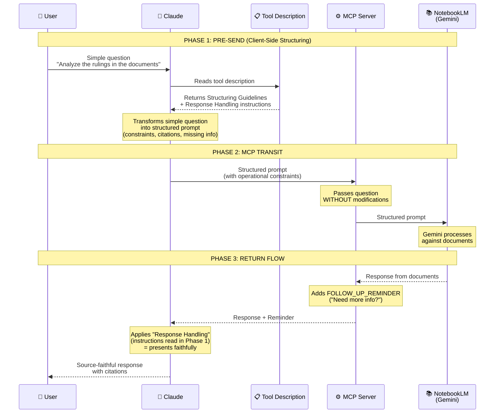

# NotebookLM MCP Structured

> **Project status (2026-08-20):** Development of notebooklm-mcp-structured is **frozen** as of this date and the repository is archived. The server is feature-complete and working: v1.1.0 ships the singleton backend (concurrent Claude Desktop surfaces share one browser) and is built on MCP SDK 1.30.0, the latest release for version 1 of the MCP protocol. The project remains available as-is; no further development is planned. Future work will continue in a successor project built on version 2 of the MCP protocol.

> **Google renamed NotebookLM (July 2026):** the product is now **Gemini Notebook** and moved from `notebooklm.google.com` to **`notebook.google.com`**, with new notebook URLs and a redesigned UI. That change is what prompted the final revision cycle of this server: v1.1.0 targets the new host, the new answer UI, and Google's redirect chain. The project keeps its historical name.

Enhanced MCP server for NotebookLM with **client-side prompt structuring** for **source fidelity**.

> **Requirements:** This MCP server is designed to work with **Claude Desktop**. It requires Claude Desktop to be installed and configured to use MCP servers.

This is a modified version of [notebooklm-mcp](https://github.com/PleasePrompto/notebooklm-mcp) that adds comprehensive structuring instructions to guide Claude in crafting prompts that enforce document fidelity for professional use cases (legal analysis, research, fact-checking).

## Key Features

### Client-Side Prompt Structuring

The MCP tool description includes comprehensive guidelines that instruct Claude on how to structure questions before sending them to NotebookLM. This ensures:

- **Source fidelity**: Responses come ONLY from uploaded documents
- **Citation requirements**: Every claim includes source attribution
- **Missing information handling**: Explicit declaration when data is unavailable
- **Multi-language support**: Works naturally with any language Claude supports
- **Question type adaptation**: Different structures for comparisons, lists, analyses, explanations, and extractions

**How It Works:**

1. User asks a simple question in any language
2. Claude reads the structuring guidelines from the tool description
3. Claude transforms the question into a well-structured prompt
4. NotebookLM receives the structured prompt and responds accordingly
5. Claude is instructed to present the response faithfully without adding external knowledge

**Why This Matters:**

NotebookLM already provides source fidelity by design (Gemini grounded on documents). **The real problem this fork solves is different:** preventing Claude from "improving" NotebookLM's responses with external knowledge when presenting them to the user.

**Design Intent (what the fork aims to achieve):**

```
┌─────────────────────────────────────────────────────┐
│ Without structuring (original MCP):                 │
│ • NotebookLM: "Document states X [Source: doc.pdf]"│
│ • Risk: Claude may add external knowledge          │
│   "Document states X. Also, based on my knowledge, │
│   Y is important to consider..."                   │
│   └─ External knowledge added! ─┘                  │
│                                                     │
│ With structuring (this fork):                       │
│ • NotebookLM: "Document states X [Source: doc.pdf]"│
│ • Claude reads Response Handling instruction        │
│ • Goal: Claude presents faithfully                  │
│   "Document states X [Source]"                     │
│   └─ Faithful presentation, no additions ─┘        │
└─────────────────────────────────────────────────────┘
```

The structuring guidelines include **two critical instruction phases**:
1. **Pre-send**: Transform questions with explicit constraints (but preserve original wording)
2. **Post-receive**: Instruct Claude to present responses faithfully WITHOUT external knowledge

This dual-phase approach is designed to maintain document fidelity throughout the workflow.

### Verification & Transparency

**How to verify the workflow:**

Since NotebookLM saves chat history in your notebooks, you can verify the entire process:

1. **Ask a question** through Claude using this MCP
2. **Open your notebook** on the Gemini Notebook web interface (https://notebook.google.com — formerly notebooklm.google.com)
3. **View the saved chat** to see:
   - The **structured prompt** that Claude sent (via the MCP)
   - The **original NotebookLM response** with all internal reference links

**What you can verify:**
- That structuring was applied correctly to your question
- The raw NotebookLM response before Claude presents it
- How Claude interpreted the Response Handling instructions
- Which language was used for structured prompts (useful for multilingual testing)

This transparency mechanism lets you empirically verify the client-side structuring approach and understand each phase of the workflow.

**Example Transformation:**

Simple question:
```
What are the main findings in the research papers?
```

Claude structures it as:
```
What are the main findings in the research papers?

Organize the response by thematic topics. Cover all aspects discussed in the documents.
For each topic:
- TOPIC: [identifying title]
- DESCRIPTION: [synthesis with context, connecting information across documents]
- EVIDENCE: "direct quote" [Source: document]

If a topic appears in multiple documents, show evidence from each.
If information is not found: [NOT FOUND IN DOCUMENTS]
```

**Critical Formatting Rule:**
- **NO decorative lines** (no `===` or `---`) as they cause NotebookLM timeouts

### Language Support

**Multilingual by design** - The fork works with multiple languages without requiring server-side configuration.

**How it works:**

The structuring guidelines in the tool description instruct Claude to "adapt to user's language". Claude interprets these instructions and applies them based on the conversational context.

**What we know for certain:**
- ✅ No server-side language detection in the MCP code
- ✅ No language-specific templates to maintain
- ✅ Tested successfully with Italian users and documents
- ✅ The approach is language-agnostic by design

**Expected behavior:**
- The system works best when using a consistent language throughout the conversation
- Claude interprets the structuring guidelines contextually
- Results may vary based on conversational context

**Important:** Using a language different from your Claude account/profile language may produce unpredictable structuring results. For consistent behavior, use your account's primary language throughout the conversation.

**Tested with Italian** - works reliably with Italian users asking questions in Italian.

**Other languages**: The architecture supports any language Claude can work with. If you use it in other languages, please share your experience to help us understand the behavior patterns!

### Automatic Connection Verification

The MCP server automatically verifies the connection to NotebookLM before executing any operation that requires it. This ensures a smooth user experience:

**How it works:**
1. When you make a request that requires NotebookLM (e.g., asking a question), the server checks if authentication is valid
2. If authentication is expired or missing, a browser window opens automatically for Google login
3. After successful login, your original request proceeds automatically

**No manual intervention needed** - the server handles authentication seamlessly within the conversation flow, even if Chrome is already running.

## Installation

### Prerequisites

- **Claude Desktop** - Required to use this MCP server
- Node.js >= 18.0.0
- npm
- A Google account for NotebookLM access

### Install from GitHub

```bash
# Clone the repository
git clone https://github.com/paolodalprato/notebooklm-mcp-structured.git

# Enter directory
cd notebooklm-mcp-structured

# Install dependencies
npm install

# Build
npm run build
```

### Configure Claude Desktop

Add to your `claude_desktop_config.json`:

**Windows:** `%APPDATA%\Claude\claude_desktop_config.json`
**macOS:** `~/Library/Application Support/Claude/claude_desktop_config.json`
**Linux:** `~/.config/Claude/claude_desktop_config.json`

```json
{
  "mcpServers": {
    "notebooklm": {
      "command": "node",
      "args": [
        "/absolute/path/to/notebooklm-mcp-structured/dist/index.js"
      ]
    }
  }
}
```

**Windows example:**
```json
{
  "mcpServers": {
    "notebooklm": {
      "command": "node",
      "args": [
        "D:\\path\\to\\notebooklm-mcp-structured\\dist\\index.js"
      ]
    }
  }
}
```

### First-time Authentication

After restarting Claude Desktop:
1. Ask Claude to check NotebookLM health: `Check notebooklm health`
2. If not authenticated, ask: `Setup notebooklm authentication`
3. A browser window will open for Google login
4. Complete login and close the browser

## Use Cases

### Legal Document Analysis
- Extract specific clauses with citations
- Compare rulings across cases
- Identify patterns in jurisprudence
- Ensure responses come only from case documents

### Research
- Literature review with source tracking
- Fact extraction from multiple documents
- Cross-reference verification
- Prevent mixing document content with external knowledge

### Professional Fact-Checking
- Verify claims against source documents
- Identify what's explicitly stated vs. inferred
- Maintain audit trail with citations
- Ensure complete transparency of information sources

## Architecture

### Process Architecture: Proxy, Backend, Direct

Claude Desktop starts one MCP server process per surface (Chat, Cowork). Both used to fight over the same persistent Chrome profile, so whichever surface started second could not query NotebookLM until the first one released it. Since v1.1.0 this is fixed: `dist/index.js` takes one of three roles, decided automatically at startup. **Claude Desktop's configuration does not change** — it still launches the same command.

| Role | When | What it does |
|------|------|---------------|
| **Proxy** | Default; what Claude Desktop launches | A thin stdio server: pipes JSON-RPC between Claude Desktop's stdio and the shared backend over localhost Streamable HTTP. Spawns the backend if none is running, and reconnects with a handshake replay if the backend dies mid-session. |
| **Backend** | Internal `--backend` flag, never set by users | The full server (browser, sessions, tools), bound to `127.0.0.1` on an ephemeral port with bearer-token auth. Exactly one runs per machine, shared by every proxy — one per Claude Desktop surface. |
| **Direct** | `NOTEBOOK_SINGLETON=false` | The legacy behavior: the full server directly on stdio, no proxy/backend split. Used for development (e.g. `npm run dev` under `tsx`), since the proxy can only spawn a compiled `dist/index.js`, never a `.ts` file. |

**Result**: Chat and Cowork can now query NotebookLM concurrently — one Chrome profile, one browser, shared behind the scenes. This was the bug the singleton backend was built to fix.

**Lifecycle**: the backend exits automatically `NOTEBOOK_BACKEND_GRACE_MS` (default 60000 ms) after its last client disconnects; a cleanly-closed proxy also sends an HTTP `DELETE`, so shutdown is prompt rather than waiting out the grace period. If no client ever connects (e.g. the spawning proxy died first), the backend exits after a 120s startup guard. Client liveness is tracked with a 30s proxy heartbeat against a 90s backend-side session TTL, swept every 15s.

**Runtime files**, in the [data directory](docs/configuration.md#storage-paths):
- `singleton.json` - the backend's port, bearer token, pid, and version, written atomically once it is listening
- `singleton.lock` - spawn lock, held briefly by whichever proxy is starting the backend
- `logs/backend.log` - the backend's log output (color codes stripped), truncated at the start of each run

**Development note**: `npm run dev` (`tsx watch src/index.ts`) cannot be spawned by the proxy, which always launches a compiled `dist/index.js` with `--backend`. Under `tsx`, either set `NOTEBOOK_SINGLETON=false` (direct mode) or hand-start a `--backend` process separately.

### Request Workflow

This diagram shows the complete flow of a request through the system:


```mermaid
sequenceDiagram
    participant U as 👤 User
    participant C as 🤖 Claude
    participant TD as 📋 Tool Description
    participant MCP as ⚙️ MCP Server
    participant NLM as 📚 NotebookLM<br/>(Gemini)

    Note over U,NLM: PHASE 1: PRE-SEND (Client-Side Structuring)
    U->>C: Simple question<br/>"Analyze the rulings in the documents"
    C->>TD: Reads tool description
    TD-->>C: Returns Structuring Guidelines<br/>+ Response Handling instructions
    Note over C: Transforms simple question<br/>into structured prompt<br/>(constraints, citations, missing info)

    Note over U,NLM: PHASE 2: MCP TRANSIT
    C->>MCP: Structured prompt<br/>(with operational constraints)
    Note over MCP: Passes question<br/>WITHOUT modifications
    MCP->>NLM: Structured prompt
    Note over NLM: Gemini processes<br/>against documents

    Note over U,NLM: PHASE 3: RETURN FLOW
    NLM-->>MCP: Response from documents
    Note over MCP: Adds FOLLOW_UP_REMINDER<br/>("Need more info?")
    MCP-->>C: Response + Reminder
    Note over C: Applies "Response Handling"<br/>(instructions read in Phase 1)<br/>= presents faithfully
    C-->>U: Source-faithful response<br/>with citations
```

### What Happens at Each Phase

| Phase | Actor | Action | Content Added/Read |
|-------|-------|--------|-------------------|
| **1a** | Claude | Reads tool description | **Structuring Guidelines**: how to transform the question |
| **1b** | Claude | Reads tool description | **Response Handling**: how to present the response |
| **1c** | Claude | Transforms question | Adds operational constraints, citation requirements, missing info handling |
| **2** | MCP Server | Transits question | *No modifications* - passes structured prompt as-is |
| **3a** | MCP Server | Modifies response | **FOLLOW_UP_REMINDER**: prompts Claude to check if more questions needed |
| **3b** | Claude | Presents response | Applies Response Handling (source fidelity) read in Phase 1 |

### Three-Level Instruction Architecture

The MCP server orchestrates **two LLMs** (Claude and NotebookLM/Gemini) using three distinct instruction mechanisms, each targeting a different actor:

| Level | Where | Target | Purpose | Code Reference |
|-------|-------|--------|---------|----------------|
| **1. Tool Description** | `ask-question.ts` | Claude | How to structure prompts, when to do follow-ups, session management | `buildAskQuestionDescription()` |
| **2. Structured Prompt** | `structuring-guidelines.ts` | NotebookLM | Source fidelity constraints, citation format, missing info handling | `buildStructuringGuidelines()` |
| **3. Response Suffix** | `handlers.ts` | Claude | Push Claude to verify completeness before replying to the user | `FOLLOW_UP_REMINDER` constant |

**Key distinction:** The structured prompt (Level 2) is sent to NotebookLM to constrain its response. But some instructions in the tool description (Level 1) and the response suffix (Level 3) never reach NotebookLM — they guide Claude's behavior before and after the NotebookLM interaction.

**Dual-purpose instructions in the tool description:**
- *For NotebookLM* (via the structured prompt Claude generates): operational constraints, citation requirements, output format
- *For Claude only* (never sent to NotebookLM): "present faithfully WITHOUT adding external knowledge", "pause, compare with the user's goal", follow-up strategy

### Key Architectural Insight

The MCP server does **not** add constraints on source fidelity *after* receiving the response. The fidelity instructions are read by Claude *before* sending the question, in the tool description. The server only adds an operational reminder ("do you need more information?"), not a behavioral constraint.

This architecture relies on Claude's ability to follow instructions read in advance, not on post-hoc technical controls. The structuring happens client-side (in Claude), making the system simpler, more flexible, and naturally multilingual.

### Why Client-Side Structuring?

**Advantages:**
1. **Multilingual by default**: Claude naturally handles any language
2. **Simpler architecture**: No server-side template management
3. **Flexible adaptation**: Claude adjusts structure based on context
4. **Future-proof**: Updates to structuring logic just require tool description changes

### Why No Decorative Lines?

NotebookLM interprets lines of `=` or `-` characters as invalid formatting, causing the system to timeout. The structuring guidelines specify plain text headers only, avoiding any decorative typography.

### Question Type Detection

Claude automatically detects question type and applies appropriate structure:

| Type | Trigger Words | Output Structure |
|------|--------------|------------------|
| Comparison | "compare", "vs", "difference" | Elements, Similarities, Differences, Synthesis |
| List | "list", "identify", "which" | Thematic topics with descriptions, evidence, cross-references |
| Analysis | "analyze", "examine", "evaluate" | Thematic topics with cross-document connections |
| Explanation | "explain", "why", "how" | Core concept, examples, related concepts, limitations |
| Extraction | (default) | Thematic topics with descriptions, evidence, cross-references |

## Tools Available

### Core Tools (require NotebookLM connection)
- `ask_question` - Ask questions to NotebookLM with session management *(triggers auto-auth if needed)*
- `reset_session` - Reset a session to start fresh *(triggers auto-auth if needed)*

### Session Management
- `list_sessions` - View all active conversation sessions
- `close_session` - Close a specific session

### Authentication & Diagnostics
- `get_health` - Check authentication, connection status, and Chrome state *(enhanced diagnostics)*
- `setup_auth` - Initial Google login
- `re_auth` - Switch Google accounts or recover from rate limits

### Notebook Library Management
- `add_notebook` - Add a notebook to your library
- `list_notebooks` - View all notebooks in your library
- `get_notebook` - Get details of a specific notebook
- `select_notebook` - Set active notebook
- `update_notebook` - Update notebook metadata
- `remove_notebook` - Remove notebook from library
- `search_notebooks` - Search notebooks by keywords
- `get_library_stats` - View library statistics

### Maintenance
- `cleanup_data` - Clean up browser data and authentication files

## Contributing

Contributions are welcome! Please feel free to submit issues or pull requests.

## Credits

- Original `notebooklm-mcp`: [Gérôme Dexheimer](https://github.com/PleasePrompto/notebooklm-mcp)
- Client-side structuring approach: Paolo Dalprato

## License

MIT

---

## FAQ

**Q: Does this work with Claude Code or other MCP clients?**
A: This MCP server is specifically designed for **Claude Desktop**. While other MCP-compatible clients might work, the automatic connection verification and authentication flow are optimized for the Claude Desktop experience.

**Q: Does this work with languages other than Italian?**
A: The system is designed to work with any language Claude supports. It has been tested with Italian and works perfectly. If you use another language, the system should adapt automatically to your profile language. We're seeking feedback from users of other languages!

**Q: Why not use server-side templates?**
A: Client-side structuring is simpler, more flexible, and naturally multilingual. Claude can adapt the structure to context better than fixed templates.

**Q: Can I customize the structuring guidelines?**
A: The guidelines are embedded in the tool description (`src/tools/definitions/ask-question.ts`). You can modify them and rebuild.

**Q: What happens if I don't structure my prompts?**
A: NotebookLM might mix document content with its general knowledge. Structured prompts enforce source fidelity.

**Q: Are there any rate limits?**
A: Free Google accounts have 50 queries/day to NotebookLM. Google AI Pro/Ultra accounts have 5x higher limits.
