# NotebookLM MCP Structured

Enhanced MCP server for NotebookLM with **client-side prompt structuring** for **source fidelity**.

> **Requirements:** This MCP server is designed to work with **Claude Desktop**. It requires Claude Desktop to be installed and configured to use MCP servers.

This is a modified version of [notebooklm-mcp](https://github.com/PleasePrompto/notebooklm-mcp) that adds comprehensive structuring instructions to guide Claude in crafting prompts that enforce document fidelity for professional use cases (legal analysis, research, fact-checking).

## Key Features

### Client-Side Prompt Structuring

The MCP tool description includes comprehensive guidelines that instruct Claude on how to structure questions before sending them to NotebookLM. This ensures:

- **Source fidelity**: Responses come ONLY from uploaded documents
- **Citation requirements**: Every claim includes source attribution
- **Missing information handling**: Explicit declaration when data is unavailable
- **Multi-language support**: Works naturally with any language Claude supports
- **Question type adaptation**: Different structures for comparisons, lists, analyses, explanations, and extractions

**How It Works:**

1. User asks a simple question in any language
2. Claude reads the structuring guidelines from the tool description
3. Claude transforms the question into a well-structured prompt
4. NotebookLM receives the structured prompt and responds accordingly
5. Claude presents the response faithfully without adding external knowledge

**Why This Matters:**

NotebookLM already provides source fidelity by design (Gemini grounded on documents). **The real problem this fork solves is different:** preventing Claude from "improving" NotebookLM's responses with external knowledge when presenting them to the user.

```
┌─────────────────────────────────────────────────────┐
│ Without structuring (original MCP):                 │
│ • NotebookLM: "Document states X [Source: doc.pdf]"│
│ • Claude presents: "Document states X. Also, based │
│   on my knowledge, Y is important to consider..."  │
│   └─ External knowledge added! ─┘                  │
│                                                     │
│ With structuring (this fork):                       │
│ • NotebookLM: "Document states X [Source: doc.pdf]"│
│ • Claude reads Response Handling instruction        │
│ • Claude presents: "Document states X [Source]"    │
│   └─ Faithful presentation, no additions ─┘        │
└─────────────────────────────────────────────────────┘
```

The structuring guidelines include **two critical instruction phases**:
1. **Pre-send**: Transform questions with explicit constraints (but preserve original wording)
2. **Post-receive**: Instruct Claude to present responses faithfully WITHOUT external knowledge

This dual-phase approach ensures complete document fidelity throughout the entire workflow.

**Example Transformation:**

Simple question:
```
What are the main findings in the research papers?
```

Claude structures it as:
```
RESPONSE INSTRUCTIONS

TASK: What are the main findings in the research papers?

OPERATIONAL CONSTRAINTS
- Use ONLY information explicitly present in uploaded documents
- DO NOT add external knowledge or interpretations
- If information is not present, state: "[NOT FOUND IN DOCUMENTS]"

REQUIRED OUTPUT FORMAT
For each finding:
- FINDING: [description]
- SOURCE: [document name/section]
- QUOTE: "direct quote supporting the finding"

CITATIONS
- Every claim MUST include source
- Use direct quotes where possible

HANDLING MISSING INFORMATION
- If information is missing, declare it explicitly

BEGIN STRUCTURED RESPONSE
```

**Critical Formatting Rule:**
- **NO decorative lines** (no `===` or `---`) as they cause NotebookLM timeouts

### Language Support

**Multilingual by design** - The fork works with multiple languages without requiring server-side configuration.

**How it works:**

The structuring guidelines in the tool description instruct Claude to "adapt to user's language". Claude interprets these instructions and applies them based on the conversational context.

**What we know for certain:**
- ✅ No server-side language detection in the MCP code
- ✅ No language-specific templates to maintain
- ✅ Tested successfully with Italian users and documents
- ✅ The approach is language-agnostic by design

**Expected behavior:**
- The system works best when using a consistent language throughout the conversation
- Claude interprets the structuring guidelines contextually
- Results may vary based on conversational context

**Tested with Italian** - works reliably with Italian users asking questions in Italian.

**Other languages**: The architecture supports any language Claude can work with. If you use it in other languages, please share your experience to help us understand the behavior patterns!

### Automatic Connection Verification

The MCP server automatically verifies the connection to NotebookLM before executing any operation that requires it. This ensures a smooth user experience:

**How it works:**
1. When you make a request that requires NotebookLM (e.g., asking a question), the server checks if authentication is valid
2. If authentication is expired or missing:
   - **Chrome is running:** You'll receive a message asking to close Chrome first
   - **Chrome is closed:** A browser window opens automatically for Google login
3. After successful login, your original request proceeds automatically

**No manual intervention needed** - the server handles authentication seamlessly within the conversation flow.

## Installation

### Prerequisites

- **Claude Desktop** - Required to use this MCP server
- Node.js >= 18.0.0
- npm
- A Google account for NotebookLM access

### Install from GitHub

```bash
# Clone the repository
git clone https://github.com/paolodalprato/notebooklm-mcp-structured.git

# Enter directory
cd notebooklm-mcp-structured

# Install dependencies
npm install

# Build
npm run build
```

### Configure Claude Desktop

Add to your `claude_desktop_config.json`:

**Windows:** `%APPDATA%\Claude\claude_desktop_config.json`
**macOS:** `~/Library/Application Support/Claude/claude_desktop_config.json`
**Linux:** `~/.config/Claude/claude_desktop_config.json`

```json
{
  "mcpServers": {
    "notebooklm": {
      "command": "node",
      "args": [
        "/absolute/path/to/notebooklm-mcp-structured/dist/index.js"
      ]
    }
  }
}
```

**Windows example:**
```json
{
  "mcpServers": {
    "notebooklm": {
      "command": "node",
      "args": [
        "D:\\path\\to\\notebooklm-mcp-structured\\dist\\index.js"
      ]
    }
  }
}
```

### First-time Authentication

After restarting Claude Desktop:
1. Ask Claude to check NotebookLM health: `Check notebooklm health`
2. If not authenticated, ask: `Setup notebooklm authentication`
3. A browser window will open for Google login
4. Complete login and close the browser

## Use Cases

### Legal Document Analysis
- Extract specific clauses with citations
- Compare rulings across cases
- Identify patterns in jurisprudence
- Ensure responses come only from case documents

### Research
- Literature review with source tracking
- Fact extraction from multiple documents
- Cross-reference verification
- Prevent mixing document content with external knowledge

### Professional Fact-Checking
- Verify claims against source documents
- Identify what's explicitly stated vs. inferred
- Maintain audit trail with citations
- Ensure complete transparency of information sources

## Architecture

### Request Workflow

This diagram shows the complete flow of a request through the system:

```mermaid
sequenceDiagram
    participant U as 👤 User
    participant C as 🤖 Claude
    participant TD as 📋 Tool Description
    participant MCP as ⚙️ MCP Server
    participant NLM as 📚 NotebookLM<br/>(Gemini)

    Note over U,NLM: PHASE 1: PRE-SEND (Client-Side Structuring)
    U->>C: Simple question<br/>"Analyze the rulings in the documents"
    C->>TD: Reads tool description
    TD-->>C: Returns Structuring Guidelines<br/>+ Response Handling instructions
    Note over C: Transforms simple question<br/>into structured prompt<br/>(constraints, citations, missing info)

    Note over U,NLM: PHASE 2: MCP TRANSIT
    C->>MCP: Structured prompt<br/>(with operational constraints)
    Note over MCP: Passes question<br/>WITHOUT modifications
    MCP->>NLM: Structured prompt
    Note over NLM: Gemini processes<br/>against documents

    Note over U,NLM: PHASE 3: RETURN FLOW
    NLM-->>MCP: Response from documents
    Note over MCP: Adds FOLLOW_UP_REMINDER<br/>("Need more info?")
    MCP-->>C: Response + Reminder
    Note over C: Applies "Response Handling"<br/>(instructions read in Phase 1)<br/>= presents faithfully
    C-->>U: Source-faithful response<br/>with citations
```



### What Happens at Each Phase

| Phase | Actor | Action | Content Added/Read |
|-------|-------|--------|-------------------|
| **1a** | Claude | Reads tool description | **Structuring Guidelines**: how to transform the question |
| **1b** | Claude | Reads tool description | **Response Handling**: how to present the response |
| **1c** | Claude | Transforms question | Adds operational constraints, citation requirements, missing info handling |
| **2** | MCP Server | Transits question | *No modifications* - passes structured prompt as-is |
| **3a** | MCP Server | Modifies response | **FOLLOW_UP_REMINDER**: prompts Claude to check if more questions needed |
| **3b** | Claude | Presents response | Applies Response Handling (source fidelity) read in Phase 1 |

### Key Architectural Insight

The MCP server does **not** add constraints on source fidelity *after* receiving the response. The fidelity instructions are read by Claude *before* sending the question, in the tool description. The server only adds an operational reminder ("do you need more information?"), not a behavioral constraint.

This architecture relies on Claude's ability to follow instructions read in advance, not on post-hoc technical controls. The structuring happens client-side (in Claude), making the system simpler, more flexible, and naturally multilingual.

### Why Client-Side Structuring?

**Advantages:**
1. **Multilingual by default**: Claude naturally handles any language
2. **Simpler architecture**: No server-side template management
3. **Flexible adaptation**: Claude adjusts structure based on context
4. **Future-proof**: Updates to structuring logic just require tool description changes

### Why No Decorative Lines?

NotebookLM interprets lines of `=` or `-` characters as invalid formatting, causing the system to timeout. The structuring guidelines specify plain text headers only, avoiding any decorative typography.

### Question Type Detection

Claude automatically detects question type and applies appropriate structure:

| Type | Trigger Words | Output Structure |
|------|--------------|------------------|
| Comparison | "compare", "vs", "difference" | Elements, Similarities, Differences, Synthesis |
| List | "list", "identify", "which" | Numbered items with descriptions and sources |
| Analysis | "analyze", "examine", "evaluate" | Subject, Observations, Evidence, Conclusions |
| Explanation | "explain", "why", "how" | Concept, Answer, Examples, Related info |
| Extraction | (default) | Data points with quotes and sources |

## Tools Available

### Core Tools (require NotebookLM connection)
- `ask_question` - Ask questions to NotebookLM with session management *(triggers auto-auth if needed)*
- `reset_session` - Reset a session to start fresh *(triggers auto-auth if needed)*

### Session Management
- `list_sessions` - View all active conversation sessions
- `close_session` - Close a specific session

### Authentication & Diagnostics
- `get_health` - Check authentication, connection status, and Chrome state *(enhanced diagnostics)*
- `setup_auth` - Initial Google login
- `re_auth` - Switch Google accounts or recover from rate limits

### Notebook Library Management
- `add_notebook` - Add a notebook to your library
- `list_notebooks` - View all notebooks in your library
- `get_notebook` - Get details of a specific notebook
- `select_notebook` - Set active notebook
- `update_notebook` - Update notebook metadata
- `remove_notebook` - Remove notebook from library
- `search_notebooks` - Search notebooks by keywords
- `get_library_stats` - View library statistics

### Maintenance
- `cleanup_data` - Clean up browser data and authentication files

## Contributing

Contributions are welcome! Please feel free to submit issues or pull requests.

## Credits

- Original `notebooklm-mcp`: [Gérôme Dexheimer](https://github.com/PleasePrompto/notebooklm-mcp)
- Client-side structuring approach: Paolo Dalprato

## License

MIT

---

## FAQ

**Q: Does this work with Claude Code or other MCP clients?**
A: This MCP server is specifically designed for **Claude Desktop**. While other MCP-compatible clients might work, the automatic connection verification and authentication flow are optimized for the Claude Desktop experience.

**Q: Does this work with languages other than Italian?**
A: The system is designed to work with any language Claude supports. It has been tested with Italian and works perfectly. If you use another language, the system should adapt automatically to your profile language. We're seeking feedback from users of other languages!

**Q: Why not use server-side templates?**
A: Client-side structuring is simpler, more flexible, and naturally multilingual. Claude can adapt the structure to context better than fixed templates.

**Q: Can I customize the structuring guidelines?**
A: The guidelines are embedded in the tool description (`src/tools/definitions/ask-question.ts`). You can modify them and rebuild.

**Q: What happens if I don't structure my prompts?**
A: NotebookLM might mix document content with its general knowledge. Structured prompts enforce source fidelity.

**Q: Are there any rate limits?**
A: Free Google accounts have 50 queries/day to NotebookLM. Google AI Pro/Ultra accounts have 5x higher limits.
